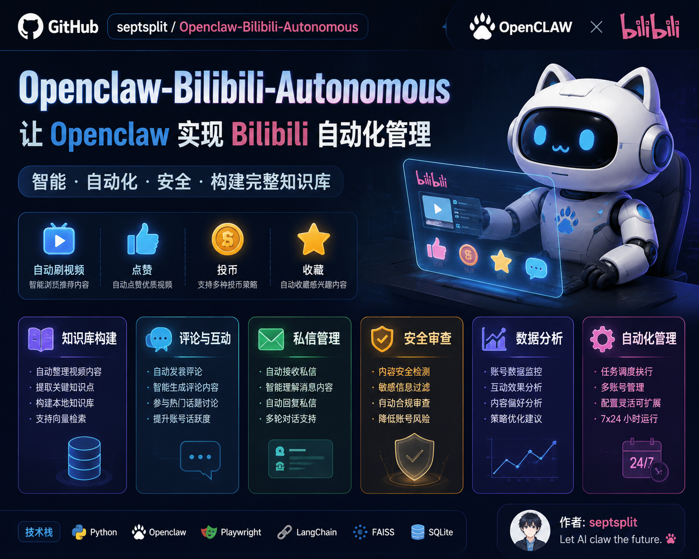
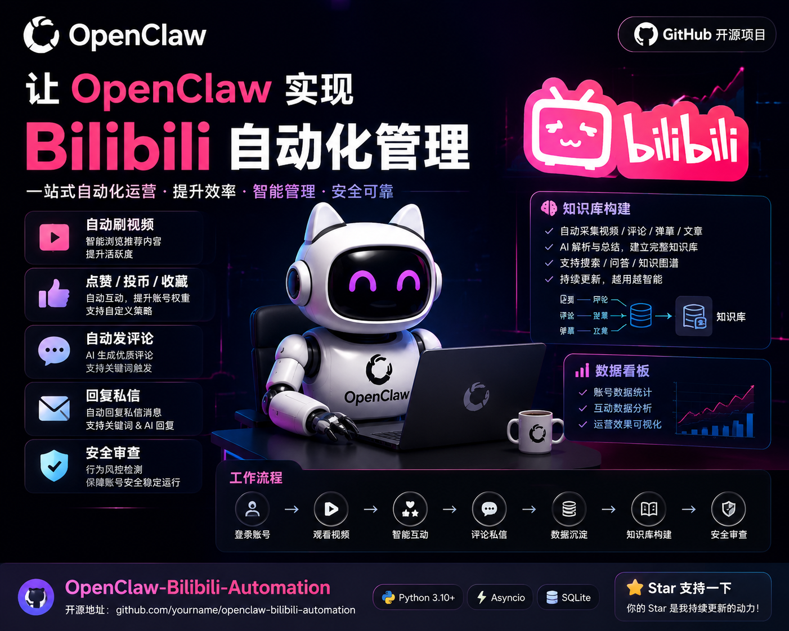
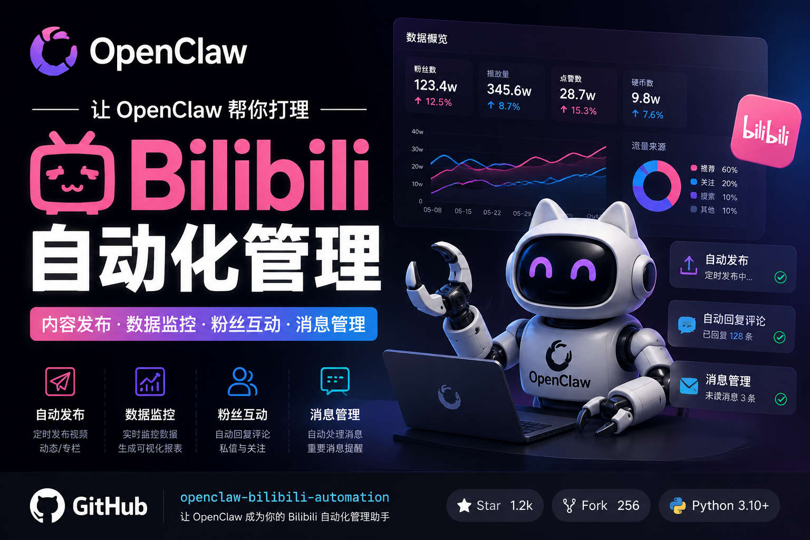

# bilibili-autonomous

B站 AI 自动互动工具 —— OpenClaw AI的大脑，自动化刷B站、点赞、投币、收藏、评论、弹幕、关注，知识归档。

---



*参考项目：https://github.com/xiaoyaya191/bilibili_learning_bot*

*本项目：https://github.com/Septsplit/Openclaw-Bilibili-Autonomous*

**注：本项目仅用于学习研究目的，请勿用于恶意用途，使用该项目进行违规操作请自行承担责任，还请各位遵守社区规则！**
---

## 📑 目录

- [📌 项目作用与用途](#项目作用与用途)
- [🔧 安装依赖](#-安装依赖)
- [⚙️ 配置方法](#配置方法)
  - [第一步：下载项目到正确目录](#第一步下载项目到正确目录)
  - [第二步：填入 B站 Cookie](#第二步填入-b站-cookie最关键)
  - [第三步：配置 Web 面板账号密码](#第三步配置-web-面板账号密码)
  - [第四步（可选）：配置 OpenClaw 联动](#第四步可选配置-openclaw-联动)
- [🚀 一键安装消息](#-一键安装消息)
- [📡 CLI 命令清单](#-cli-命令清单)
  - [自动刷（核心功能）](#自动刷核心功能)
  - [能量管理](#能量管理)
  - [原子互动动作](#原子互动动作)
  - [内容获取](#内容获取)
  - [关注管理](#关注管理)
  - [私信](#私信)
  - [知识库](#知识库)
  - [心情系统](#心情系统)
  - [配置与状态](#配置与状态)
  - [全局选项](#全局选项)
- [🌐 Web 控制面板](#-web-控制面板)
- [🏗 架构与工作原理](#架构与工作原理)
  - [整体架构](#整体架构)
  - [工作流程](#工作流程)
- [📁 项目文件结构](#-项目文件结构)
- [🛠 二次开发指南](#二次开发指南)
  - [扩展新的 B站 动作](#扩展新的-b站-动作)
  - [修改阈值策略](#修改阈值策略)
  - [添加新的配置项](#添加新的配置项)
  - [Web 面板开发](#web-面板开发)
- [📷 项目截图](#-项目截图)
- [📄 License](#-license)
- [🤝 更新日志](#-更新日志)

---

## 📌 项目作用与用途

本项目是 **OpenClaw AI Agent** 的 B站自动化工具，让 AI 能够：

- **自动刷视频**：定时拉取推荐 feed，AI 评分筛选，自动执行互动动作
- **点赞 / 投币 / 收藏**：根据 AI 评分阈值自动判断是否执行
- **评论 / 弹幕**：AI 生成内容，自动发送到 B站
- **关注 / 取关**：自动管理关注列表，清理长期不活跃UP
- **私信**：自动回复粉丝私信，支持主动推送
- **知识归档**：高分视频自动归档到本地知识库
- **精力系统**：内置能量管理，防止过度操作触发 B站风控
- **Web 控制面板**：可视化配置 + 实时状态监控
- **CLI 工具集**：40+ 原子命令，支持管道组合和脚本调用

**适合人群**：有 OpenClaw 的用户、想要自动化 B站 互动的开发者

---

## 🔧 安装依赖

本项目**不内置 LLM**（由 OpenClaw 提供），但需要以下 Python 依赖：

```
bilibili-api-python >= 17.0.0   # B站 API
colorama >= 0.4.6                # 彩色终端输出
flask >= 3.0                    # Web 面板
bcrypt >= 5.0                   # Web 登录密码加密
openai-whisper                  # 视频字幕识别（可选，首次用 whisper 时自动下载 ~150MB 模型）
```

**安装方式：**

```bash
cd bilibili-autonomous

# 创建虚拟环境（推荐）
python3 -m venv .venv
.venv/bin/pip install -r requirements.txt

# 或者直接用系统 Python
pip3 install -r requirements.txt
```

> **macOS 用户需提前安装 ffmpeg**：`brew install ffmpeg`（Whisper 字幕识别需要）

---

## ⚙️ 配置方法

### 第一步：下载项目到正确目录

```bash
# 克隆 / 下载项目后，放入 OpenClaw 的 skills 目录：
git clone <repo_url> ~/.openclaw/workspace/skills/bilibili-autonomous
```

### 第二步：填入 B站 Cookie（最关键）

Cookie 是 B站登录凭证，没有它所有操作都无法执行。

**获取 Cookie 步骤：**

1. Chrome 浏览器登录 [bilibili.com](https://bilibili.com)
2. 打开任意视频页面，按 **F12** → **Network（网络）** 标签
3. 刷新页面，点击任意一个 B站 请求（如 api.bilibili.com）
4. 在右侧 **Request Headers** 中找到 `Cookie` 字段，**Ctrl+C** 复制整段

**填入 Cookie（两种方式）：**

```bash
# 方式一：CLI 配置器（推荐）
cd ~/.openclaw/workspace/skills/bilibili-autonomous
./bin/bilibili-autonomous configure
# 选 [C] → [1] 粘贴 Cookie 字符串 → 回车

# 方式二：手动编辑
vim Data/bilibili_cookies.json
```

**`Data/bilibili_cookies.json` 格式：**
```json
{
  "SESSDATA": "你的SESSDATA值",
  "bili_jct": "你的bili_jct值",
  "DedeUserID": "你的DedeUserID数字",
  "ac_time_value": "你的ac_time_value值"
}
```

> 所有字段缺一不可。可用 configure 的 [1] 粘贴整段自动解析，或用 [3] 手动填4个字段。

### 第三步：配置 Web 面板账号密码

```bash
# 启动 Web 面板（首次会自动要求设置账号密码）
./bin/bilibili-autonomous serve

# 浏览器打开：http://127.0.0.1:8765
# 首次访问按页面提示设置 admin 账号密码
```

**初始管理员账号**：`admin`
**初始管理员密码**：`test123`

> 首次设置后凭据保存在 `Data/web_auth.json`，bcrypt 加密存储。

### 第四步（可选）：配置 OpenClaw 联动

在 OpenClaw 的 **HEARTBEAT.md** 中添加刷B站自动化：

```markdown
## 刷B站（OpenClaw 自控模式）
- 触发：距上次刷B站 >2h 且 08:00-23:00
- 检查精力：`~/.openclaw/workspace/skills/bilibili-autonomous/bin/bilibili-autonomous energy status`
  - 若 disabled=false 且 current=0 → 精力耗尽，跳过
- 自动刷：`~/.openclaw/workspace/skills/bilibili-autonomous/bin/bilibili-autonomous watch --count 3 --no-energy`
- 评论/弹幕：OpenClaw LLM 生成内容后调用 comment/danmaku 命令
- 消耗精力：energy consume --n 3
- 成功后只回报"刷了 X 个视频，Y 个互动"
```

并创建 cron 任务（每2小时自动触发）：
- cron 表达式：`0 */2 * * *`
- 时区：`Asia/Shanghai`
- 投递目标：`qqbot:c2c:<你的QQ号>`

---

## 🚀 一键安装消息

复制下方整段消息，发送给 OpenClaw，OpenClaw 会自动完成配置：

```
我来帮你配置 bilibili-autonomous 项目，请按以下步骤执行：

1. 如果没有克隆项目，先克隆到 ~/.openclaw/workspace/skills/bilibili-autonomous
   （已有项目则跳过这步）

2. 进入项目目录并安装依赖：
   cd ~/.openclaw/workspace/skills/bilibili-autonomous
   python3 -m venv .venv
   .venv/bin/pip install -r requirements.txt

3. 提示用户获取 B站 Cookie：
   - Chrome 登录 B站 → F12 → Network → 任意请求 → Headers → Cookie 复制
   - 然后运行 ./bin/bilibili-autonomous configure → 选 C → 选 1 → 粘贴 Cookie

4. 配置 HEARTBEAT.md 添加刷B站自动化（参考项目 README 的 HEARTBEAT 配置段落）

5. 创建 cron 任务，每2小时自动刷B站：
   - cron 表达式：0 */2 * * *
   - 时区：Asia/Shanghai
   - 投递到 qqbot:c2c:<用户QQ号>

6. 完成后报告配置结果
```


---

## 📡 CLI 命令清单

所有命令均在 `bin/bilibili-autonomous` 下执行。

### 自动刷（核心功能）

```bash
./bin/bilibili-autonomous watch --count 3              # 自动刷 N 个视频
./bin/bilibili-autonomous watch --count 3 --no-energy   # 不检查精力
./bin/bilibili-autonomous watch --count 3 --dry-run     # 试跑不真发
./bin/bilibili-autonomous start                         # 启动 Web + 写 HEARTBEAT.md
```

### 能量管理

```bash
./bin/bilibili-autonomous energy status                 # 查看当前精力
./bin/bilibili-autonomous energy consume --n 1          # 消耗 N 点精力
./bin/bilibili-autonomous energy refill                # 手动加满
./bin/bilibili-autonomous energy set-max 30            # 重置精力上限
./bin/bilibili-autonomous energy disabled on           # 关闭精力限制（无限精力）
./bin/bilibili-autonomous energy disabled off          # 开启精力限制
./bin/bilibili-autonomous energy-schedule status        # 查看活跃时段配置
./bin/bilibili-autonomous energy-schedule add-active 20:00 23:00   # 添加活跃时段
./bin/bilibili-autonomous energy-schedule clear        # 清除时段配置
```

### 原子互动动作

```bash
./bin/bilibili-autonomous like <bvid>                   # 点赞
./bin/bilibili-autonomous coin <bvid>                  # 投币（默认1枚）
./bin/bilibili-autonomous coin <bvid> --num 2         # 投币 N 枚
./bin/bilibili-autonomous favorite <bvid>              # 收藏
./bin/bilibili-autonomous favorite <bvid> --auto-check --score 8.5   # 按评分自动判断收藏
./bin/bilibili-autonomous comment <bvid> --text "内容"   # 发评论
./bin/bilibili-autonomous danmaku <bvid> --text "弹幕"   # 发弹幕
./bin/bilibili-autonomous follow <uid>                  # 关注用户
./bin/bilibili-autonomous unfollow <uid>              # 取关用户
./bin/bilibili-autonomous dm.send <uid> --text "内容"   # 发私信
```

### 内容获取

```bash
./bin/bilibili-autonomous feed --limit 10               # 获取推荐 feed
./bin/bilibili-autonomous video <bvid>                # 获取视频信息
./bin/bilibili-autonomous user <uid>                   # 获取用户信息
./bin/bilibili-autonomous subtitles <bvid>             # 获取字幕
./bin/bilibili-autonomous understand <bvid>           # v4 字幕理解
./bin/bilibili-autonomous understand5 <bvid>           # v5 封面+字幕+评论+弹幕全理解
./bin/bilibili-autonomous understand5 <bvid> --with-comments --with-danmaku  # 带热评弹幕
```

### 关注管理

```bash
./bin/bilibili-autonomous follow.status                 # 关注状态概览
./bin/bilibili-autonomous follow.history               # 关注历史
./bin/bilibili-autonomous follow.inactive_scan         # 扫描长期不活跃关注
```

### 私信

```bash
./bin/bilibili-autonomous dm.check                      # 检查未读私信
./bin/bilibili-autonomous dm.send <uid> --text "内容"   # 发私信
```

### 知识库

```bash
./bin/bilibili-autonomous knowledge list                # 列知识分类
./bin/bilibili-autonomous knowledge cat <分类>          # 列某分类下文章
./bin/bilibili-autonomous knowledge read <id>          # 读文章
./bin/bilibili-autonomous knowledge save --score 8.5 --body "内容" <bvid> "标题" "UP"   # 归档视频
```

### 心情系统

```bash
./bin/bilibili-autonomous mood status                  # 查看心情状态
./bin/bilibili-autonomous mood set <心情词>            # 设置心情
./bin/bilibili-autonomous mood nudge +1               # 推送心情变化
./bin/bilibili-autonomous mood auto off                # 关闭自动心情变化
```

### 配置与状态

```bash
./bin/bilibili-autonomous configure                    # CLI 交互配置器（Q=快速 A=全方位 C=Cookie）
./bin/bilibili-autonomous serve                       # 启动 Web 面板（默认端口 8765）
./bin/bilibili-autonomous serve --port 8080           # 自定义端口
./bin/bilibili-autonomous status                      # 综合状态（含今日配额）
./bin/bilibili-autonomous thresholds                  # 查看阈值配置
./bin/bilibili-autonomous actions.list                # 查看动作历史
./bin/bilibili-autonomous actions.get <path>          # 查单个动作详情
./bin/bilibili-autonomous tools-log                   # 查看工具调用日志
./bin/bilibili-autonomous openapi                     # 查看完整 OpenAPI 工具清单
./bin/bilibili-autonomous gate <分数> <action>        # 查询阈值门禁（如 gate 8.5 coin）
```

### 全局选项

```bash
./bin/bilibili-autonomous <command> --dry-run          # 试跑，不真发动作（安全测试）
./bin/bilibili-autonomous <command> --help             # 查看命令帮助
```

---

## 🌐 Web 控制面板

启动：`./bin/bilibili-autonomous serve`

访问地址：**http://127.0.0.1:8765**

**初始账号**：`admin`
**初始密码**：`test123`

Web 面板功能：
- 实时状态监控（今日已点赞/投币/评论/收藏数量）
- 精力值可视化
- 所有配置项可视化编辑
- Cookie 一键配置
- 操作日志查看

---

## 🏗 架构与工作原理

### 整体架构

```
用户 / Cron 触发
    ↓
OpenClaw AI（决策大脑）
    ↓ 调用 CLI
bilibili-autonomous（执行工具集）
    ↓ 调用
B站 API（bilibili-api-python）
    ↓
B站 服务器
```

**核心设计原则**：
- **OpenClaw = AI 大脑**：负责决策（评分/生成评论/判断动作）
- **bilibili-autonomous = 纯执行工具**：负责调用 B站 API，不内置 AI
- **HEARTBEAT 驱动**：OpenClaw 定时触发，自己编排任务逻辑

### 工作流程

**自动刷流程（watch）：**
```
1. 拉取推荐 feed（feed --limit N）
2. 对每个视频按配置阈值决定动作（like/coin/favorite/follow）
3. 调用原子 CLI 执行动作
4. 消耗精力，记录操作日志
```

**OpenClaw 联动流程：**
```
1. HEARTBEAT 触发（每2小时）
2. OpenClaw 拉 feed 拿候选视频
3. OpenClaw LLM 评分（0-10）
4. 高分视频 OpenClaw 生成评论
5. OpenClaw 调用 comment --text 执行
6. 消耗精力，汇报结果
```

---

## 📁 项目文件结构

```
bilibili-autonomous/
├── bin/
│   ├── bilibili-autonomous              # Shell 包装脚本（入口）
│   └── openclaw_comment_gen.sh          # OpenClaw 评论生成脚本
├── src/
│   ├── __init__.py
│   ├── main.py                          # CLI 入口 + 全部原子命令定义
│   ├── bapi.py                           # B站 API 封装（登录/互动/feed/评论/弹幕）
│   ├── throttle.py                       # B站 API 限流器（799 限速保护）
│   ├── safety.py                         # 敏感词过滤（政治/广告/违规内容）
│   ├── config.py                         # 默认配置 + 配置读写
│   ├── energy.py                         # 精力值系统
│   ├── energy_schedule.py                # 精力时段管理（活跃/低效时段 bonus/penalty）
│   ├── mood.py                           # 心情系统（影响评论风格）
│   ├── scorer.py                         # 评分阈值门控（gate 命令）
│   ├── keywords.py                        # 关键词匹配引擎
│   ├── favorite_keys.py                  # 关键词收藏模块
│   ├── archive.py                        # 知识归档模块
│   ├── knowledge.py                      # 知识库管理
│   ├── follow.py                         # 关注/取关 + 不活跃扫描
│   ├── dm.py                             # 私信收发 + 自动回复
│   ├── actions_log.py                    # 操作日志写入（jsonl + markdown 格式）
│   ├── human.py                          # 真人节奏工具（防风控）
│   ├── understand.py                     # v4 字幕理解（whisper / pick_subtitle）
│   ├── state_view.py                    # 综合状态视图（status 命令）
│   ├── web_panel.py                     # Flask Web 面板
│   └── cli_config.py                    # CLI 配置器（Q/A/C 三模式）
├── templates/
│   └── web.html                         # Web 面板 HTML 模板
├── Data/                                # 运行时数据（不随项目提交）
│   ├── bilibili_cookies.json            # B站 Cookie（凭据，敏感）
│   ├── config.json                      # 用户配置（阈值/概率/开关等）
│   ├── energy.json                      # 精力状态持久化
│   ├── energy_schedule.json             # 精力时段配置
│   ├── mood_state.json                  # 心情状态
│   ├── state.json                       # 今日配额/冷却状态
│   ├── follow_state.json                # 关注状态/历史
│   ├── web_auth.json                    # Web 面板账号密码（bcrypt）
│   ├── web_settings.json                # Web 设置（secret_key）
│   ├── logs/                           # 操作日志
│   │   ├── operations-YYYY-MM-DD.jsonl # 每日操作记录
│   │   └── llm_costs-YYYY-MM-DD.jsonl # LLM 调用成本记录
│   ├── actions/                         # 动作详细记录（markdown）
│   │   ├── comments/
│   │   ├── danmaku/
│   │   ├── dms/
│   │   ├── follows/
│   │   ├── understandings/
│   │   └── highlights/
│   └── knowledge/                       # 知识库（按分类存储 markdown）
├── requirements.txt                     # Python 依赖
├── SKILL.md                            # OpenClaw Skill 定义
└── README.md                           # 本文件
```

---

## 🛠 二次开发指南

### 扩展新的 B站 动作

1. 在 `src/bapi.py` 中添加 API 方法（参考现有如 `like()`, `coin()` 等）
2. 在 `src/main.py` 中添加 CLI 命令（参考 `cmd_like()`, `cmd_coin()` 等）
3. 在 `src/actions_log.py` 中添加日志记录（参考 comment 的 `write_action_markdown`）

### 修改阈值策略

阈值配置在 `Data/config.json`，相关字段：

```json
{
  "scoring": {
    "coin_min": 6.5,
    "favorite_min": 7.0,
    "comment_min": 7.5,
    "follow_min": 8.0,
    "archive_min": 7.5
  },
  "autonomy": {
    "enable_like": true,
    "prob_like": 0.8,
    "enable_coin": true,
    "prob_coin": 0.5
  }
}
```

### 添加新的配置项

1. 在 `src/config.py` 的 `DEFAULTS` 字典中添加默认值
2. 在 `src/cli_config.py` 中添加配置菜单项
3. 用户通过 `./bin/bilibili-autonomous configure` 交互修改

### Web 面板开发

主要路由在 `src/web_panel.py`：
- `/` — 状态面板
- `/tools` — 工具日志
- `/api/energy` — 精力状态 API
- `/api/config` — 配置读取/写入

---

---

## 📄 License

MIT License

---

## 🤝 更新日志

### v5.9
- 新增 Cookie 配置菜单（`configure → C`）
- 修复 `--dry-run` 无效问题
- 修复 `follow` 崩溃问题
- 修复 `start`/`serve` Web 启动崩溃
- 修复 `energy disabled` 数值异常
- 修复 `understand5 --with-comments` 热评获取
- 修复 `dm.send` API 签名问题
- 修复 `danmaku` 动作不写 markdown 记录问题

### v5.8
- 精力时段系统（活跃/低效时段 bonus/penalty）
- 心情系统 v2（影响评论风格）
- 私信自动回复增强

### v5.4
- `understand5` 视频全理解（封面+字幕+热评+弹幕）
- 知识归档系统
- 关键词收藏增强
